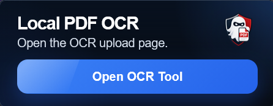

<p align="center">
  
</p>

# Local PDF OCR

Local PDF OCR is a privacy-focused OCR tool for Firefox and Waterfox. It converts scanned or image-based PDFs into searchable PDFs using a local FastAPI backend and Tesseract OCR.

Files are processed on the user's computer and are not uploaded to a cloud service.

## Screenshot

<p align="center">
  
</p>

## Features

* Convert scanned PDFs into searchable PDFs
* Local OCR processing
* Signed Firefox/Waterfox extension
* Clean browser extension popup interface
* FastAPI backend
* Tesseract OCR engine
* Works with screenshot-heavy PDFs, receipts, forms, and scanned documents
* Designed for privacy-sensitive document workflows

## Current Status

This is an early prototype.

### Working

* Local backend
* PDF upload
* OCR text extraction
* Searchable PDF output
* Firefox/Waterfox extension popup
* Mozilla-approved signed `.xpi` release

### Known Limitations

* OCR accuracy depends on scan quality
* Complex layouts, maps, receipts, and tiny screenshot text may be imperfect
* Backend must be started before using the extension
* Currently supports Firefox and Waterfox only
* Windows-focused setup

## Requirements

* Windows
* Firefox or Waterfox
* Local backend included with the project
* Tesseract OCR included or installed locally

## Installation

Local PDF OCR has two installation options.

### Option 1: Install the Signed Extension

1. Go to the latest GitHub release.
2. Download the signed `.xpi` file.
3. Open Firefox or Waterfox.
4. Drag the `.xpi` file into the browser.
5. Confirm the installation.

The extension requires the local backend to be running before OCR can be used.

### Option 2: Load the Extension Manually

This method is useful for development.

#### Firefox

1. Open Firefox.
2. Go to:

```txt
about:debugging#/runtime/this-firefox
```

3. Click **Load Temporary Add-on**.
4. Select the extension's `manifest.json` file.
5. The extension should now appear in Firefox.

#### Waterfox

1. Open Waterfox.
2. Go to:

```txt
about:debugging#/runtime/this-firefox
```

3. Click **Load Temporary Add-on**.
4. Select the extension's `manifest.json` file.
5. The extension should now appear in Waterfox.

## How to Run

1. Start the backend by double-clicking:

```txt
start_backend.bat
```

2. Open the Firefox or Waterfox extension.

3. Click **Open OCR Tool**.

4. Upload a scanned or image-based PDF.

5. Wait for OCR processing to finish.

6. Download the searchable PDF output.

## Project Structure

```txt
local-pdf-ocr/
├─ backend/
├─ extension/
│  ├─ icons/
│  ├─ manifest.json
│  ├─ popup.html
│  ├─ popup.css
│  └─ popup.js
├─ release/
├─ start_backend.bat
├─ logo-readme.png
└─ README.md
```

## Privacy

Local PDF OCR processes files on your own computer. PDFs are not uploaded to a remote server or cloud OCR service.

The Firefox extension connects only to the local backend running on the user's machine.

```txt
http://127.0.0.1:8000
http://localhost:8000
```

## Why Firefox and Waterfox?

Local PDF OCR currently targets Firefox and Waterfox because the project is designed around privacy-conscious, local-first document processing.

Chromium-based browser support may be added in the future.

## Notes

This project is currently a prototype and may not handle every PDF perfectly. OCR quality depends on the original document quality, image resolution, text size, contrast, and layout complexity.
